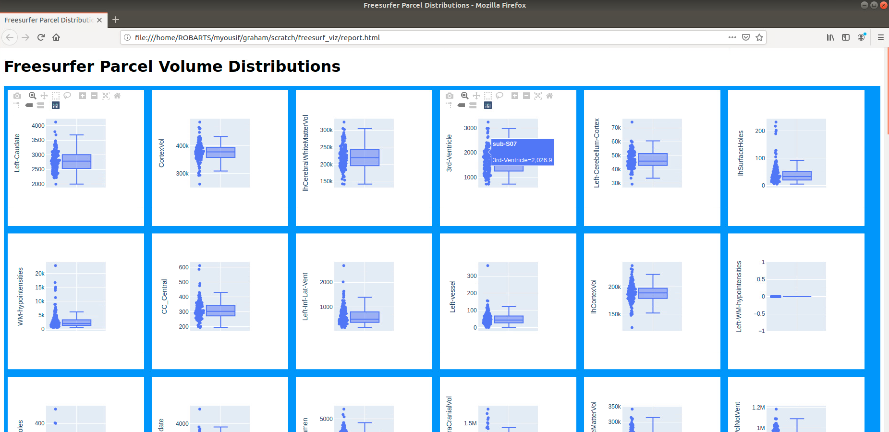

# Freesurfer-parcel-distribution-visualization
A simple pipeline that uses snakemake, plotly and jinja2 to quickly visualize distributions of volume or surface quantities

## Example report generated

